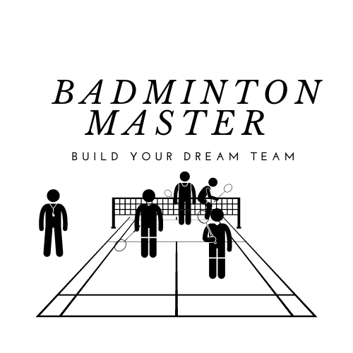

<h1 align="center">Badminton Master</h1>  

  

  Welcome to the Badminton Tournament Game Project, a captivating virtual experience that puts you in the role of a skilled team manager in the world of men's double badminton tournaments. Developed as part of the SENG201 assignment, this project offers an immersive and aesthetic journey into the competitive realm of regional and international badminton matches.

  
To take the source code from the zip file and load it into Eclipse:
-----------------------------------------------------
1. First thing you should do is extract the zip file(the zip file called GameProj-Master-3.zip) by right click on the file and click on extract.
2. Once you have extracted the file you will see a file that contain  this README, java jar file, src code, doc, report, UML diagram and Use case diagram.
3. The next thing to do is go to Eclipse and create new empty Java Project. After that right click on the src folder and choose Import. Then choose File system under General tab and then browse to extracted zip file and select 'src' folder that contain src code (see step 2), and tick the box for src and hit finish.
4. When the source code already imported into eclipse, you need to open seng201_game package and run GameHandler.java class to play the Badminton Masters game.
 
To build and run Badminton Masters game from the command line:
-----------------------------------------------------
1. Ensure you are in the root project directory. This directory contains  this README, java jar file, src code, doc, report, UML diagram and Use case diagram.
2. When you already in the right directory, right click in the blank area of the folder -> open in terminal
3. To start Badminton Masters game with a graphical user interface run:
     java ...jar
   To start Island Trader game with a command line interface run:
     java ...jar cmd

